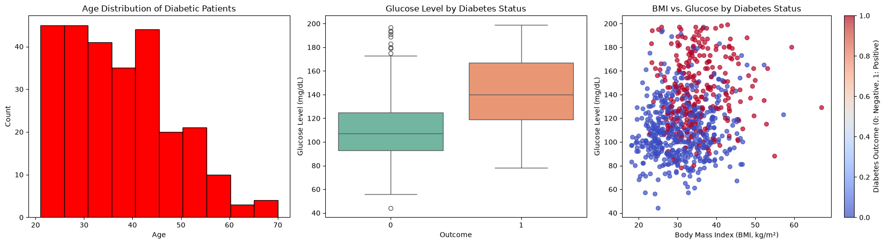

# Diabetes Classification Project

This project uses machine learning to predict whether a person has diabetes.

The main work is in:

```text
머신러닝_최종과제_이명지.ipynb
```

The data file is:

```text
diabetes.csv
```

## What This Project Does

The project answers one main question:

> Can we predict diabetes from health measurements like glucose, blood pressure, BMI, insulin, age, and pregnancy count?

The notebook:

1. Looks at the diabetes dataset
2. Cleans unrealistic `0` values
3. Scales the data
4. Trains a Logistic Regression model
5. Checks the model's accuracy and F1-score
6. Tries hyperparameter tuning with cross-validation

## Dataset

The dataset has:

- 768 rows
- 8 input features
- 1 target column called `Outcome`

`Outcome` means:

| Value | Meaning |
| --- | --- |
| `0` | No diabetes |
| `1` | Diabetes |

The dataset is not perfectly balanced:

| Outcome | Count |
| --- | ---: |
| No diabetes | 500 |
| Diabetes | 268 |

This matters because the model sees more non-diabetes examples than diabetes examples.

## Data Cleaning

Some columns had `0` values that do not make sense medically.

For example, a person's blood pressure or BMI should not be `0`.

These columns were cleaned:

| Column | Number of `0` values |
| --- | ---: |
| `Glucose` | 5 |
| `BloodPressure` | 35 |
| `SkinThickness` | 227 |
| `Insulin` | 374 |
| `BMI` | 11 |

The notebook replaced those `0` values with missing values, then filled them using the training data:

- Mean was used for `Glucose`, `BloodPressure`, and `BMI`
- Median was used for `Insulin` and `SkinThickness`

After that, the features were scaled with `StandardScaler`.

## Graphs

The notebook made three graphs to understand the data:



What the graphs show:

- Many diabetes cases appear in younger and middle adult ages.
- People with diabetes usually have higher glucose levels.
- BMI and glucose do not show a simple straight-line relationship.
- Glucose looks more strongly related to diabetes than BMI.

## Model

The model used for diabetes prediction is:

```text
Logistic Regression
```

The data was split into:

| Split | Rows |
| --- | ---: |
| Training data | 614 |
| Test data | 154 |

The split used:

- `test_size=0.2`
- `random_state=42`
- `stratify=y`

## Results

The first Logistic Regression model got:

| Metric | Score |
| --- | ---: |
| Accuracy | 0.7078 |
| F1-score | 0.5455 |

That means the model correctly predicted about 70.8% of the test data.

The F1-score is lower because predicting diabetes cases is harder than predicting non-diabetes cases.

## Tuning

The notebook also tried to improve the model with:

- L2 regularization
- 5-fold cross-validation
- `GridSearchCV`

It tested these `C` values:

```text
0.01, 0.1, 1, 10, 100
```

The best value was:

```text
C = 1
```

The tuned model had the same final test result:

| Model | Accuracy | F1-score |
| --- | ---: | ---: |
| Original model | 0.7078 | 0.5455 |
| Tuned model | 0.7078 | 0.5455 |

So tuning did not improve the score because the best value was already the model's default setting.

## Main Takeaways

- Glucose was the most useful signal in the graphs.
- The dataset has more non-diabetes examples than diabetes examples.
- `Insulin` and `SkinThickness` had many missing-like `0` values.
- The final model worked reasonably well, but it still struggled to identify diabetes cases.
- Hyperparameter tuning confirmed that the default Logistic Regression setting was already the best option tested.

## How to Run

Install the main packages:

```bash
pip install numpy pandas matplotlib seaborn scikit-learn jupyter
```

Then open the notebook:

```bash
jupyter lab
```

Run:

```text
머신러닝_최종과제_이명지.ipynb
```

from top to bottom.

## Project Files

```text
.
├── README.md
├── diabetes.csv
├── images/
│   └── diabetes_eda.png
├── 머신러닝_최종과제_이명지.ipynb
├── pyproject.toml
├── uv.lock
└── src/
    └── ml_final_pj/
        └── __init__.py
```

Note: the notebook also includes a separate Hugging Face/Gemma news classification exercise at the end.
